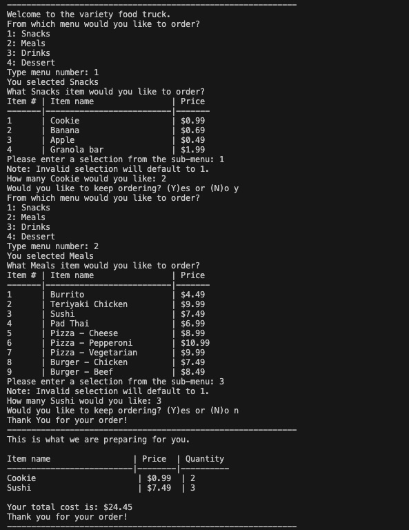

# python-challenge-1
# Variety Food Truck Ordering System

## Description
This Python program simulates an ordering system for a food truck. Customers can browse through different menu categories (Snacks, Meals, Drinks, Dessert), select items they wish to order, specify quantities, and finally see a summary of their order along with the total cost.

## Features
- **Menu Categories**: The program supports multiple categories of menu items, including Snacks, Meals, Drinks, and Desserts.
- **Dynamic Ordering**: Customers can continuously add items to their order until they choose to finish.
- **Order Summary**: The program displays an itemized receipt of all items ordered, their prices, quantities, and the total cost.

## How It Works
1. The program displays a greeting and presents the customer with menu categories.
2. The customer selects a category, then chooses items from the category and specifies the quantity.
3. The customer can choose to keep ordering or finish their order.
4. After the order is complete, an itemized receipt is printed, showing the total cost.

## Code Structure
- **Menu Dictionary**: The `menu` dictionary stores all menu items categorized by type (Snacks, Meals, Drinks, Dessert) and their respective prices.
- **Order List**: The `order_list` stores each item ordered by the customer, including the item name, price, and quantity.
- **Main Loop**: The program runs in a loop allowing customers to add multiple items to their order until they decide to stop.

## Challenge Instructions
The starter code provided includes the code for printing the menu for the customer, which was part of one of your Day 3 activities. You will be adapting this menu to allow customers to place an order, which includes storing the customer's order and printing the receipt with the total price of all items ordered. The starter code includes comments, which you may use as a guide for the steps you need to add.
Order System
1. Create an empty list. This list will later store a customer's order in dictionary format, as follows:

[
  {
    "Item name": "string",
    "Price": float,
    "Quantity": int
  },
  {
    "Item name": "string",
    "Price": float,
    "Quantity": int
  },
]

2. After the sub-menu is printed, prompt the customer to enter their selection from the menu, saving it as a variable menu_selection.
3. Use input validation to check if the customer input menu_selection is a number. If it isn't, print an error message. If it is a number, convert the input to an integer and use it to check if it is in the keys of menu_items.
4. If the user input is not in the menu_items keys, print an error. Otherwise, perform the following actions:
• Get the item name from the menu_items dictionary and store it as a variable.
• Ask the customer for the quantity of the menu item, using the item name variable in the question, and let them know that the quantity will default to 1 if their input is invalid. Save their answer as a variable called quantity.
• Check that the customer input is a number. If it isn't, set the quantity to the value 1. If it is a number, convert the variable to an integer.
• Append the customer's order to the order list in dictionary format with the following keys: "Item name", "Price", and "Quantity. You will need this information to print the receipt at the end of the order. The price should be found in the menu_items dictionary.
5. Inside the continuous while loop that prompts the customer if they would like to keep ordering, write a match:case statement that checks for y or n (upper or lowercase), and includes a default option if neither letter is entered by the customer. The following actions should be performed for each case:
• y: Set the place_order variable to True and break from the continuous while loop.
• n: Set the place_order variable to False, print "Thank you for your order", and break from the continuous while loop.
• Default: Tell the customer to try again because they didn't type a valid input.
Order Receipt
6. Create a for loop to loop through the order list.
7. Inside the loop, save the value of each key as their own variable: item_name, price, and quantity.
8. Calculate the number of empty spaces that should be added to the display so that the receipt uses the following format:

Item name                 | Price  | Quantity
--------------------------|--------|----------
Apple                     | $0.49  | 1
Tea - Thai iced           | $3.99  | 2
Fried banana              | $4.49  | 3

9. Create the space strings as their own variables using string multiplication.
10. Print the line for the receipt using the format in Step 8.
11. Upon exiting the for loop, use list comprehension and sum() to calculate the total price of the order and display it to the customer. Make sure you multiply the price by the quantity in your list comprehension.
